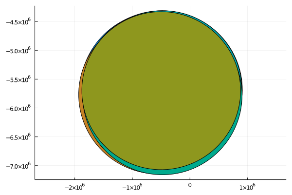

# GeoDataFrames

[](https://evetion.github.io/GeoDataFrames.jl/stable)
[](https://evetion.github.io/GeoDataFrames.jl/dev)
[](https://travis-ci.com/evetion/GeoDataFrames.jl)

Simple geographical vector interaction built on top of [ArchGDAL](https://github.com/yeesian/ArchGDAL.jl/). Inspiration from geopandas.

** this is a draft, it needs polishing **

# Installation
```julia
] add https://github.com/evetion/GeoDataFrames.jl.git
] add GeoDataFrames  # once registered
```

# Usage
Writing
```julia
using GeoDataFrames; const GDF=GeoDataFrames
using DataFrames

coords = zip(rand(10), rand(10))
df = DataFrame(geom=createpoint.(coords), name="test");
GDF.write("test_points.shp", df)
```

Reading
```julia
df = GDF.read("test_points.shp")
10×2 DataFrame
 Row │ name    geom
     │ String  IGeometr…
─────┼───────────────────────────────────────────
   1 │ test    Geometry: POINT (0.2360926400353…
   2 │ test    Geometry: POINT (0.2445619453460…
   3 │ test    Geometry: POINT (0.4504663468371…
   4 │ test    Geometry: POINT (0.0886989855586…
   5 │ test    Geometry: POINT (0.0323344938606…
   6 │ test    Geometry: POINT (0.1574232985696…
   7 │ test    Geometry: POINT (0.9677152948776…
   8 │ test    Geometry: POINT (0.0047328946715…
   9 │ test    Geometry: POINT (0.7389241862917…
  10 │ test    Geometry: POINT (0.1207370929831…
```

Geometric operations
```julia
df.geom = buffer(df.geom, 10);
df
10×2 DataFrame
 Row │ name    geom
     │ String  IGeometr…
─────┼───────────────────────────────────────────
   1 │ test    Geometry: POLYGON ((20.638287717…
   2 │ test    Geometry: POLYGON ((20.885374828…
   3 │ test    Geometry: POLYGON ((20.270896831…
   4 │ test    Geometry: POLYGON ((20.023799591…
   5 │ test    Geometry: POLYGON ((20.802042371…
   6 │ test    Geometry: POLYGON ((20.695573646…
   7 │ test    Geometry: POLYGON ((20.902189040…
   8 │ test    Geometry: POLYGON ((20.114554257…
   9 │ test    Geometry: POLYGON ((20.599242971…
  10 │ test    Geometry: POLYGON ((20.937183925…
```

Reprojection
```julia
df.geom = reproject(df.geom, GFT.EPSG(4326), GFT.EPSG(28992))
df
10×2 DataFrame
 Row │ geom                               name
     │ IGeometr…                          String
─────┼───────────────────────────────────────────
   1 │ Geometry: POLYGON ((-461372.5299…  test
   2 │ Geometry: POLYGON ((-405767.2483…  test
   3 │ Geometry: POLYGON ((-423945.8813…  test
   4 │ Geometry: POLYGON ((-426947.9961…  test
   5 │ Geometry: POLYGON ((-424503.7859…  test
   6 │ Geometry: POLYGON ((-412986.0226…  test
   7 │ Geometry: POLYGON ((-453290.1043…  test
   8 │ Geometry: POLYGON ((-480255.6989…  test
   9 │ Geometry: POLYGON ((-418753.1604…  test
  10 │ Geometry: POLYGON ((-435978.6036…  test
```

Plotting
```julia
using Plots
plot(df.geom)
```


# TODO
- Prepared geometry, spatial indices (LibGEOS) (probably can't be done as GDAL OGR is not directly compatible)
- IGeometry should be IGeometry{WKBType} for easy Schema detection, fix upstream
- Empty geom column name fix should be moved upstream
- More drivers selected on extension
- CRS stored in metadata
- Work on Geointerface integration
- Work on spatial joins/filters
- Override showing of WKT geometry on print for performance

