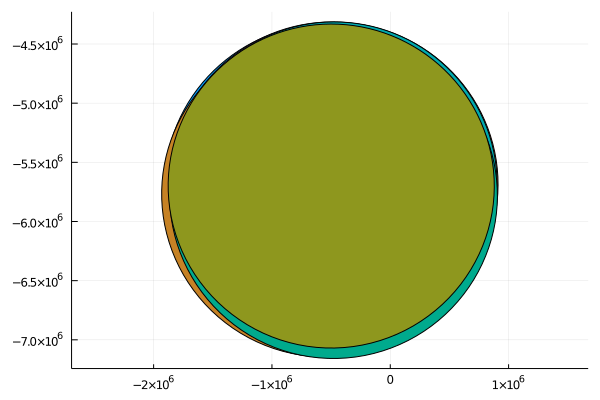

# Operations
Most operations here are the ArchGDAL operations that are exported again to work on Vectors of geometries as well.
Like [`buffer`](@ref) below, it just calls `buffer.(df.geom)`, note the dot. Hence, if you can't find your preferred
[ArchGDAL operations](https://yeesian.com/ArchGDAL.jl/stable/geometries/), you can still apply them yourself.

## Geometric operations
```julia
df.geom = buffer(df.geom, 10);  # points turn into polygons
df
10×2 DataFrame
 Row │ geom                  name
     │ IGeometr…             String
─────┼──────────────────────────────
   1 │ Geometry: wkbPolygon  test
   2 │ Geometry: wkbPolygon  test
   3 │ Geometry: wkbPolygon  test
   4 │ Geometry: wkbPolygon  test
   5 │ Geometry: wkbPolygon  test
   6 │ Geometry: wkbPolygon  test
   7 │ Geometry: wkbPolygon  test
   8 │ Geometry: wkbPolygon  test
   9 │ Geometry: wkbPolygon  test
  10 │ Geometry: wkbPolygon  test
```

## Reprojection
```julia
df.geom = reproject(df.geom, EPSG(4326), EPSG(28992))
10-element Vector{ArchGDAL.IGeometry{ArchGDAL.wkbPolygon}}:
 Geometry: POLYGON ((-472026.042542408 -4406233.59953401,-537 ... 401))
 Geometry: POLYGON ((-417143.506054105 -4395423.99277048,-482 ... 048))
 Geometry: POLYGON ((-450303.142569437 -4301418.89063867,-515 ... 867))
 Geometry: POLYGON ((-434522.645535154 -4351075.81124634,-500 ... 634))
 Geometry: POLYGON ((-443909.665585927 -4412565.43193349,-509 ... 349))
 Geometry: POLYGON ((-438405.666500747 -4299366.23767677,-503 ... 677))
 Geometry: POLYGON ((-400588.951193713 -4365333.532287,-46626 ... 287))
 Geometry: POLYGON ((-409160.489179734 -4388484.98554538,-474 ... 538))
 Geometry: POLYGON ((-453963.150526169 -4408927.89965336,-519 ... 336))
 Geometry: POLYGON ((-498317.413693272 -4321687.31588764,-563 ... 764))
```

## Plotting
```julia
using Plots
plot(df.geom)
```

